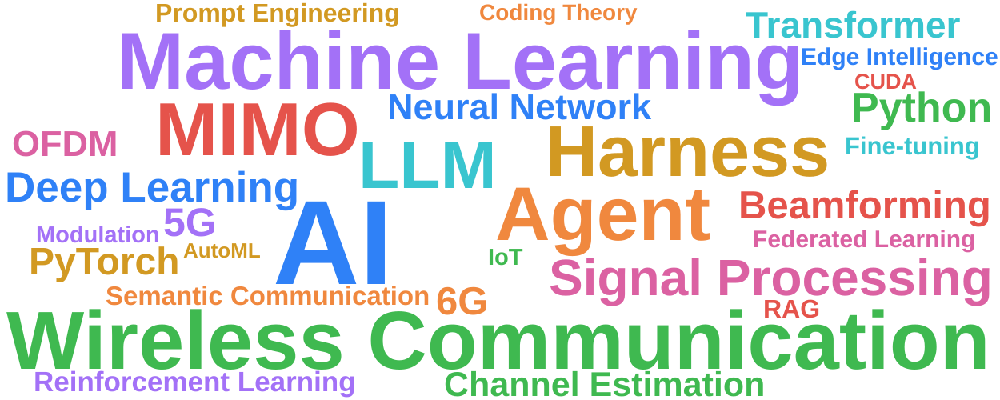

<picture>
  <source media="(prefers-color-scheme: dark)" srcset="https://raw.githubusercontent.com/sunflower070203/sunflower070203/output/github-contribution-grid-snake-dark.svg">
  <source media="(prefers-color-scheme: light)" srcset="https://raw.githubusercontent.com/sunflower070203/sunflower070203/output/github-contribution-grid-snake.svg">
  
</picture>

_generated with [Platane/snk](https://github.com/Platane/snk)_

  
  <picture>
    <source media="(prefers-color-scheme: dark)" srcset="https://github-profile-summary-cards.vercel.app/api/cards/most-commit-language?username=sunflower070203&theme=github_dark">
    <source media="(prefers-color-scheme: light)" srcset="https://github-profile-summary-cards.vercel.app/api/cards/most-commit-language?username=sunflower070203&theme=github">
    
  </picture>

<i>🌐 Language / 语言: 点击下方标签切换 · click the section below to switch</i>

<b>🇬🇧 English</b>

 

## 👨‍🎓 About Me

- 🏫 Southeast University (SEU) — Information Engineering
- 🔬 Currently focusing on: Wireless Communication & Machine Learning
- 💡 Research interests: AI development & applications

## 📫 Contact Me

  
  
  

<b>🇨🇳 中文</b>

 

## 👨‍🎓 About Me

- 🏫 东南大学 — 信息工程
- 🔬 当前重心：无线通信、机器学习
- 💡 研究兴趣：AI 开发与应用

## 📫 Contact Me

  
  
  

